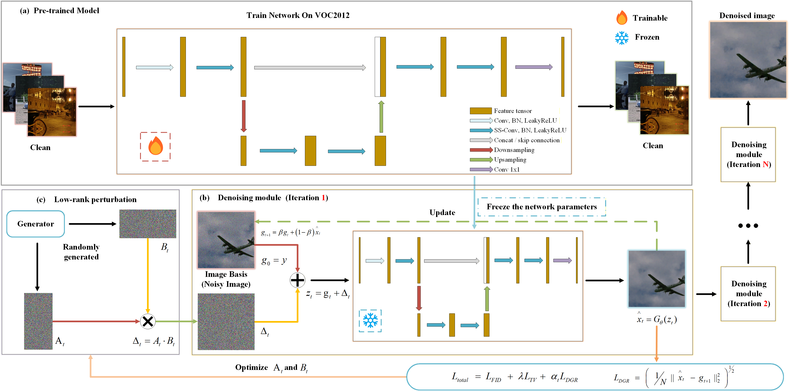
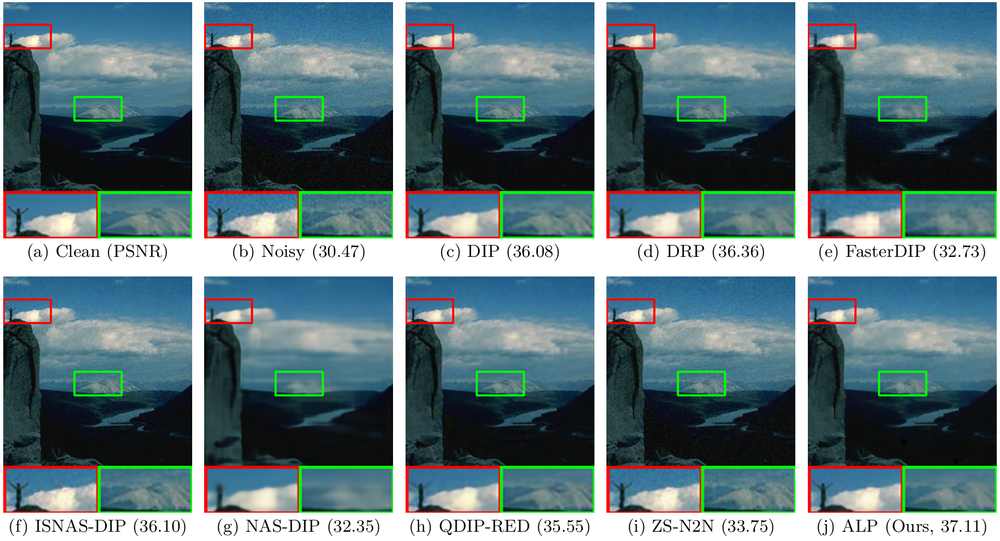
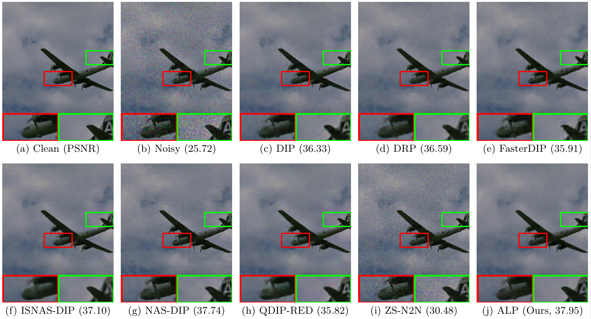
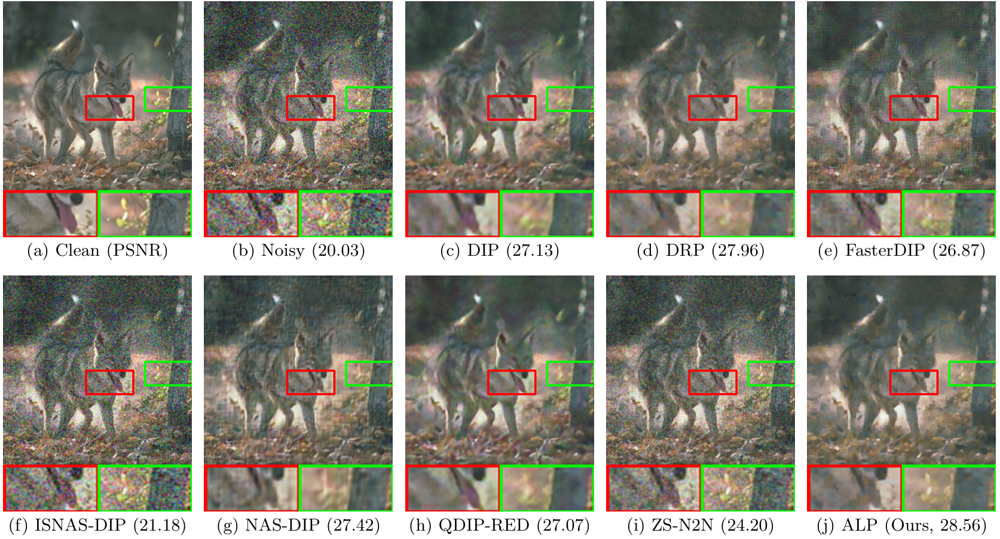
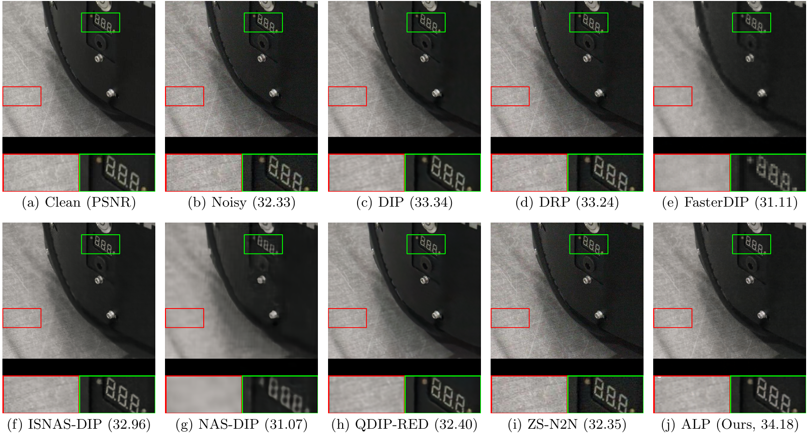
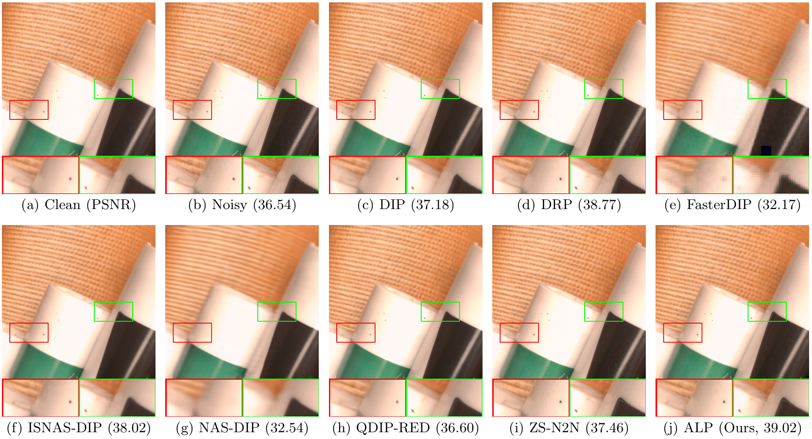
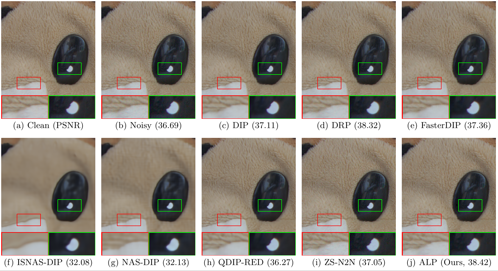

# Beyond Random Projection: Anchored Low-Rank Perturbation and Dynamic Guidance for Frozen-Backbone Zero-Shot Denoising
This repository provides the official implementation of our method proposed in the manuscript:

---

## Network Architecture

The overall framework of our proposed approach is illustrated as follows:



After N iterations, the final denoised image is produced.

---

## Qualitative Comparison

Representative results comparing our method with existing approaches are shown below.  
Our approach demonstrates improved performance in terms of visual quality and structural fidelity:








---

## Installation And Demo

```bash
git clone https://github.com/Hu-China/Anchored-Low-Rank-Projector.git
cd Anchored-Low-Rank-Projector
conda create -n ALP python=3.10
conda activate ALP
cd 1_ALP
python Main_Start.py
```
## Cite This
```
```